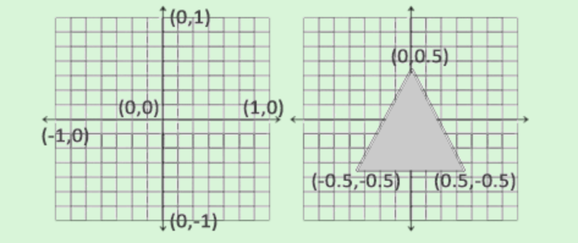
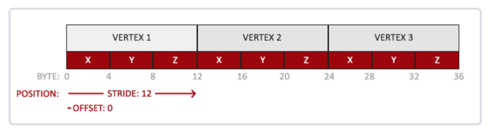

##三角形绘制
###前言
本系列文章主要是自身学习 OpenGLES 的一些总结。平常开发做的很多工作都是和图像处理有关系的，一般是通过 GPUImage 来实现的，比如：滤镜、特效、水印等等。本人对这一块比较感兴趣，所以打算深入学习一下 GPUImage 的底层实现，也就是其中之一的 OpenGLES 这一块的知识。

文章附带 [demo](https://github.com/ShengQiangLiu/LearnOpenGLES) 统一放在在 github 中。

很多人说把第一个三角形绘制出来，就能入门 OpenGLES，他们说的没错，我也是这样入门的，我们先从绘制第一个三角形开始。

### 一、iOS OpenGLES 上下文环境
1、创建 UIView 子类，并重写 + (Class)layerClass 方法

```
// 必须重新该方法，用于支持 OpenGLES 绘制
+ (Class)layerClass
{
    return [CAEAGLLayer class];
}

```

2、配置 CAEAGLLayer

```
self.eaglLayer = (CAEAGLLayer *)self.layer;
// CALayer 默认是透明的，必须将它设为不透明才能让其可见
self.eaglLayer.opaque = YES;
// 设置描绘属性，在这里设置不维持渲染内容以及颜色格式为 RGBA8
self.eaglLayer.drawableProperties = [NSDictionary dictionaryWithObjectsAndKeys:
                                     [NSNumber numberWithBool:NO], kEAGLDrawablePropertyRetainedBacking, kEAGLColorFormatRGBA8, kEAGLDrawablePropertyColorFormat, nil];
                                         
```
3、初始化 OpenGLES 上下文

```
// 初始化 OpenGLES 上下文为 2.0 版本
self.context = [[EAGLContext alloc] initWithAPI:kEAGLRenderingAPIOpenGLES2];
if (!self.context || ![EAGLContext setCurrentContext:self.context])
{
    NSLog(@"Failed to initialize OpenGLES 2.0 context.");
}
```

OpenGLES iOS 的初始化环境完成。

### 二、绑定缓冲区

生成渲染缓冲区（Render Buffer）和帧缓冲区（Frame Buffer），并将渲染缓冲区绑定到帧缓冲区

```
glGenRenderbuffers(1, &_colorRenderBuffer);
glBindRenderbuffer(GL_RENDERBUFFER, _colorRenderBuffer);
[self.context renderbufferStorage:GL_RENDERBUFFER fromDrawable:self.eaglLayer];
//    glRenderbufferStorage(GL_RENDERBUFFER, GL_RGB, MTScreenWidth, MTScreenHeight);
    
glGenFramebuffers(1, &_frameBuffer);
glBindFramebuffer(GL_FRAMEBUFFER, _frameBuffer);
glFramebufferRenderbuffer(GL_FRAMEBUFFER, GL_COLOR_ATTACHMENT0, GL_RENDERBUFFER, _colorRenderBuffer);

```
#### 帧缓冲区对象（FBO）

帧缓冲区对象（Frame Buffer Object），简称为 FBO。帧缓冲区是一个图像对象的容器。虽然帧缓冲区的名称中包含一个“缓冲区”字眼，但是其实它根本不是缓冲区。实际上，并不存在与一个帧缓冲区对象相关联的真正内存存储空间。相反，帧缓冲区对象是一种容器，它可以保存其它确定有内存存储并且可以进行渲染的对象，例如纹理或渲染缓冲区。


 * 创建并绑定 FBO

```
glGenFramebuffers (GLsizei n, GLuint* framebuffers)
glBindFramebuffer (GLenum target, GLuint framebuffer)

```
FBO 创建后，需要绑定才能修改和使用它。参数比较简单，直接参考代码示例。

 * 销毁 FBO

```
glDeleteFramebuffers (GLsizei n, const GLuint* framebuffers)

```

#### 渲染缓冲区对象（RBO）
渲染缓冲区对象（Render Buffer Object），简称为 RBO。渲染缓冲区是一种图像表面，它是专门为了绑定到 FBO 设计的。一个渲染缓冲区对象可以是一个颜色表面、模版表面或者深度／模版组合表面。


 * 创建并绑定 RBO

```
glGenRenderbuffers (GLsizei n, GLuint* renderbuffers)
glBindRenderbuffer (GLenum target, GLuint renderbuffer)
```

 * 为 RBO 分配内存空间

```
glRenderbufferStorage (GLenum target, GLenum internalformat, GLsizei width, GLsizei height)
// glRenderbufferStorage(GL_RENDERBUFFER, GL_RGB, ScreenWidth, ScreenHeight);
```

在 iOS 上为 RBO 分配内存空间使用下述方法：

```
- (BOOL)renderbufferStorage:(NSUInteger)target fromDrawable:(nullable id<EAGLDrawable>)drawable;

```


 * 销毁 RBO 
 
```
glDeleteRenderbuffers (GLsizei n, const GLuint* renderbuffers)
```

* 将 RBO 绑定到 FBO

RBO 创建完成，需要将 RBO 绑定到 FBO 上面，一个 FBO 有多个绑定点可以进行绑定：一个深度绑定点、一个模版绑定点，以及多个颜色绑定点。可以使用 

```
glGetIntegerv (GLenum pname, GLint *params)
```
来查出一次可以绑定多少颜色缓冲区。将 RBO 绑定到 FBO 上面：

```
glFramebufferRenderbuffer (GLenum target, GLenum attachment, GLenum renderbuffertarget, GLuint renderbuffer)

Example:
// 将 renderBuffer 绑定到 framebuffer 的颜色附件 GL_COLOR_ATTACHMENT0 上
glFramebufferRenderbuffer(GL_FRAMEBUFFER, GL_COLOR_ATTACHMENT0, GL_RENDERBUFFER, renderBuffer);

```
其中帧缓冲区附件说明如下：

附件名称         | 描述           
--------------------|------------------
GL_COLOR_ATTACHMENT(0-i) | 第i个颜色缓冲区（0-GL_MAX_COLOR_ATTACHMENTS-1）0为默认的颜色缓冲区   
GL_DEPTH_ATTACHMENT       | 深度缓冲区  
GL_STENCIL_ATTACHMENT  | 模板缓冲区

### 三、链接顶点属性

现在我们向着色器中传入数据。顶点着色器允许我们指定任何以顶点属性为形式的输入。

#### 顶点坐标
顶点坐标是标准化设备坐标(Normalized Device Coordinates, NDC)，x、y 和 z 在 -1.0 到 1.0 之间。




示例中的三角形顶点数据设置如下代码所示，以顶点位置为例，对照上图坐标系统，就比较容易理解三角形的位置。

```
// 三角形位置，通过顶点着色器的 positon 属性传入顶点值
static GLfloat vertices[] =
{
    -0.5f, -0.5f, 0.0f, // left
    0.5f, -0.5f, 0.0f, // right
    0.0f,  0.5f, 0.0f  // top
};
    
GLint positionAttrib = glGetAttribLocation(_program, "position");
glVertexAttribPointer(positionAttrib, 3, GL_FLOAT, GL_FALSE, 0, vertices);
glEnableVertexAttribArray(positionAttrib);

```

我们的顶点缓冲数据会被解析为下面这个样子：



通过 glVertexAttribPointer 函数告诉 OpenGLES 该如何解析顶点：

```
glVertexAttribPointer (GLuint indx, GLint size, GLenum type, GLboolean normalized, GLsizei stride, const GLvoid* ptr)
```
glVertexAttribPointer函数的参数非常多，所以我会逐一介绍它们：

* 第一个参数指定我们要配置的顶点属性。我们要传入的是顶点的位置，所以传入的是顶点属性的变量值。
* 第二个参数指定顶点属性的大小。顶点属性是一个vec3，它由3个值组成，所以大小是3。
* 第三个参数指定数据的类型，这里是 GL_FLOAT (GLSL中vec*都是由浮点数值组成的)。
* 第四个参数表示数据是否归一化。设置为 GL_TRUE，数据的范围为 0 到 1 之间；我们这里设置为 GL_FALSE ;
* 第五个参数叫做步长（Stride），连续顶点属性组之间的间隔。如果下个组位置数据在3个float之后，我们就会把步长设置为3 * sizeof(float)，后面讲纹理会用到。现在我们这里数据是紧密排列的，OpenGLES 会帮我们处理好（只有当数值是紧密排列时才可用）。
* 最后一个参数表示位置数据在缓冲中起始位置的偏移量(Offset)。由于位置数据在数组的开头，所以这里是填写数组首地址。

告诉 OpenGLES 如何解析顶点数据之后，使用 glEnableVertexAttribArray 函数启用顶点属性；顶点属性默认是禁用的。 


## **************************
## 顶点数据缓冲区——VBO、VAO、EBO

名字解释如下

* 顶点缓冲对象：Vertex Buffer Object，VBO
* 顶点数组对象：Vertex Array Object，VAO
* 索引缓冲对象：Element Buffer Object，EBO或Index Buffer Object，IBO


